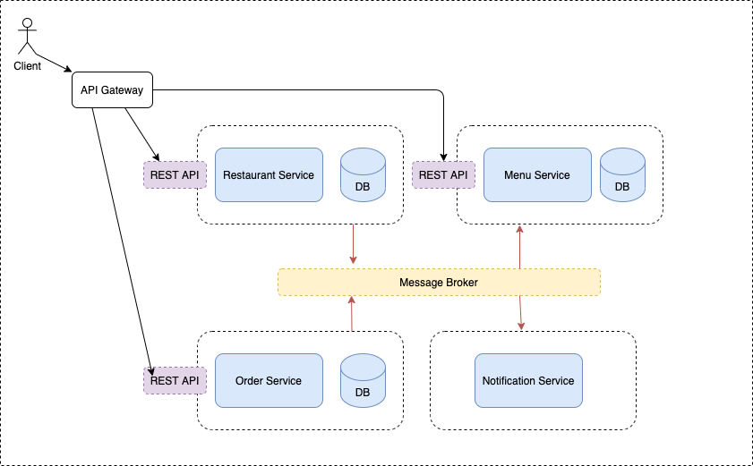
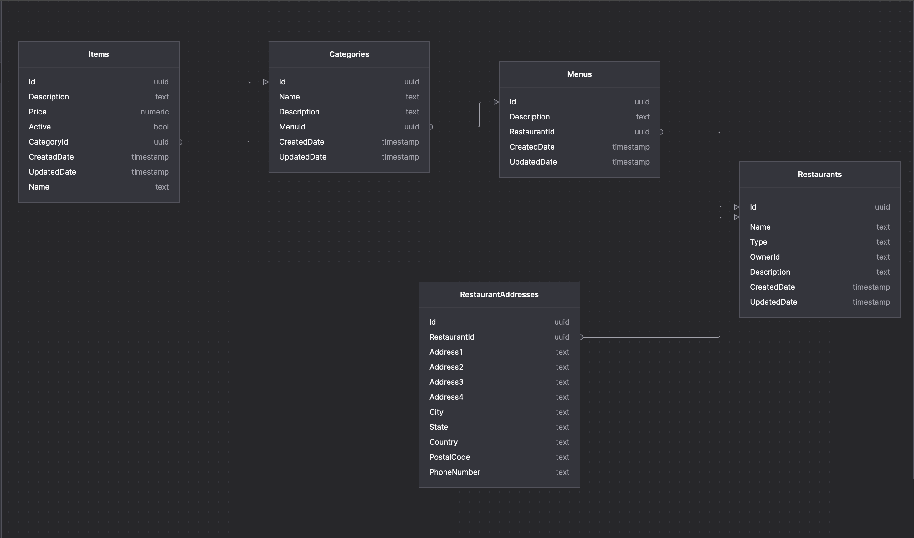

Ordo - Menu and Ordering App

# Frontend

## Home Page

## Login Page

## Restuarant Home Page

## Search Results For Customers

## Restuarant Setting Page

## Menu Creation and Edit Page

# Backend

## Architecture

## DB Design

## Endpoints

https://api.ordo.worthless.app/swagger

## Tech Stack:

- Docker
- .Net 5/6
- Entity Framework
- PostgreSQL
- RabbitMQ
- NGINX
